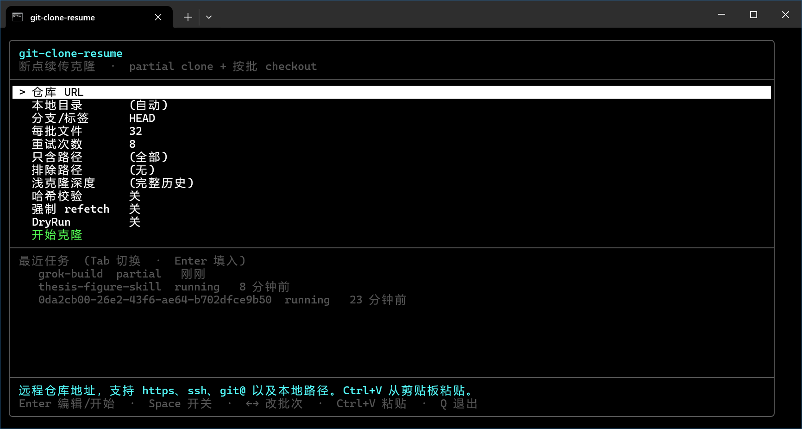
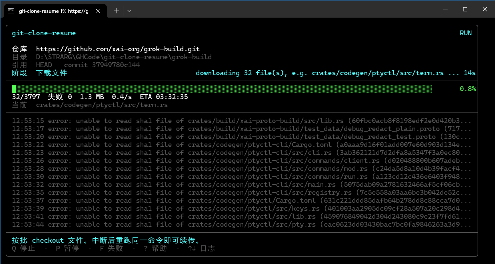

# Git 断点续传克隆（Windows）

针对 GitHub 等网络不稳定场景：先用 **partial clone** 只拉 commit/tree 元数据，再 **按批 checkout 文件**。中断后用同一条命令再跑即可续传。

对应 Linux 参考脚本：<https://github.com/chaihahaha/git-cheatsheet> 中的 `clone_1by1.sh`。

交互式全屏 TUI（无参数启动进入向导；克隆中可暂停 / 停止，重跑同一命令续传）：

| 向导 | 克隆中 |
| --- | --- |
|  |  |

## 文件

| 文件 | 说明 |
| --- | --- |
| `git-clone-resume.ps1` | 主脚本，PowerShell 5.1 / 7+ |
| `git-clone-resume.tui.ps1` | 全屏 TUI（向导、进度面板、快捷键），由主脚本自动加载 |
| `git-clone-resume.cmd` | 双击或 cmd 下调用的启动器（无参数会打开 TUI 向导） |
| `snap/` | README 截图（向导主页面、克隆运行界面） |

## 依赖

- [Git for Windows](https://git-scm.com/download/win) **>= 2.19**（partial clone）
- Windows PowerShell 5.1（系统自带）或 PowerShell 7+
- 建议打开 Windows 长路径：`git config --global core.longpaths true`

## 用法

交互式（推荐）：双击 `git-clone-resume.cmd`，或在终端里不带 URL 运行，会打开全屏 TUI 向导。剪贴板里如果是仓库地址会自动填入；底栏会显示当前选项的简短说明。

```bat
git-clone-resume.cmd
git-clone-resume.cmd https://github.com/user/repo.git
```

或：

```powershell
powershell -NoProfile -ExecutionPolicy Bypass -File .\git-clone-resume.ps1
powershell -NoProfile -ExecutionPolicy Bypass -File .\git-clone-resume.ps1 https://github.com/user/repo.git
```

在 Windows Terminal / 现代控制台里，带 URL 启动同样进入进度面板：百分比、ETA、活动日志、失败列表。脚本/CI 或输出被重定向时自动退回原来的纯日志模式。

常用参数：

```powershell
# 指定目录和分支
.\git-clone-resume.ps1 https://github.com/user/repo.git -Ref main -OutDir D:\src\repo

# 只拉部分路径
.\git-clone-resume.ps1 https://github.com/user/repo.git -Include src/*,docs/* -Exclude *.bin

# 更大批次（更快，中断粒度更粗）
.\git-clone-resume.ps1 https://github.com/user/repo.git -BatchSize 64 -MaxRetries 12

# 续传时按 blob 哈希校验已存在文件
.\git-clone-resume.ps1 https://github.com/user/repo.git -Verify

# 只列出文件，不下载 blob
.\git-clone-resume.ps1 https://github.com/user/repo.git -DryRun

# 强制 / 禁用全屏 TUI
.\git-clone-resume.ps1 https://github.com/user/repo.git -Tui
.\git-clone-resume.ps1 https://github.com/user/repo.git -NoTui

# 从本机历史恢复最近一次未完成的克隆
.\git-clone-resume.ps1 -ResumeLast
```

完整帮助：`git-clone-resume.cmd -Help`

### TUI 快捷键

克隆过程中（底栏会随阶段切换提示）：

| 键 | 作用 |
| --- | --- |
| `Q` / `Ctrl+C` | 当前 git 命令结束后停止；再按一次强制结束 |
| `P` / `Esc` | 当前批次结束后暂停 |
| `Space` | 从暂停恢复 |
| `F` | 切换失败文件列表 |
| `↑` `↓` / `j` `k` | 滚动活动日志 |
| `End` | 跟随最新日志 |
| `?` / `H` | 帮助 |
| `Enter` | 结束页关闭 |

向导里：`Enter` 编辑或开始，`Space` 切换开关，`←` `→` 改批次大小，`Tab` 最近任务，`Ctrl+V` 粘贴 URL，`Q` 退出。高亮某一选项时，底栏上一行会显示该选项的简短说明（Guide）。

历史记录写在 `%LOCALAPPDATA%\git-clone-resume\history.json`。框线在中文控制台里若变宽，会自动改用 ASCII；也可设 `GCR_ASCII=1` 强制 ASCII。

## 工作原理

1. `git init` + `remote.origin.partialclonefilter=blob:none`（不直接 `git clone`，这样元数据 fetch 失败也可重试）
2. `git fetch --filter=blob:none origin <ref>` 只拉 commit / tree
3. 把 HEAD 钉在该 commit SHA 上，避免中途远端更新导致续传错位
4. `git ls-tree -r` 得到文件清单（**不用 -l**，否则 blob:none 会为了拿 size 把全部 blob 拉下来；也不用 `-z`，PowerShell 5.1 会把 NUL 截断）
5. 分批 `git checkout <sha> -- file1 file2 ...`，由 promisor remote 按需拉 blob
6. 成功的路径追加写入 `.git/partial-resume/done.txt`
7. 再次运行：跳过已落盘文件。整批 checkout 失败立刻拆成单文件（单文件才指数退避）。结束时修复 Windows 上被弄乱的 git index

进度目录（不会进工作区）：

```
.git/partial-resume/
  meta.txt      URL / ref / 钉住的 commit
  files.tsv     待处理文件清单
  done.txt      已完成路径（追加写入）
  failed.txt    多次重试仍失败的路径
  log.txt       运行日志
```

## 比原 bash 脚本多做的事

- 目录已存在时续传，不会因为 `git clone` 到一半而从头失败
- 元数据 fetch 与 blob checkout 都有重试 / 指数退避
- 批次 checkout；整批失败立刻拆成单文件，避免同一批重试十几次（sha1 missing / Directory not empty）
- Windows 长路径、`http.version=HTTP/1.1`、低速断开、UTF-8 路径、`index.lock` 清理
- 跳过 submodule gitlink；可用 `-Include` / `-Exclude` 过滤
- Ctrl+C 或断电后重跑同一命令即可，不需要手动改文件列表
- 交互式全屏 TUI：无参数向导、进度面板、暂停/停止、最近任务续传（`-NoTui` 可关闭）

## 注意事项

- **不要**删掉目标目录里的 `.git`，否则进度和已下 blob 都没了。
- 私有仓库走本机已有的凭据即可（Git Credential Manager / `gh auth` / SSH key）。
- 子模块不会自动递归；要对子模块再执行一次本脚本。
- Git LFS 文件 checkout 后如需真正指针内容，请再执行 `git lfs pull`。
- 若 fetch 阶段就反复 `HTTP/2` / `RPC failed`，脚本已强制 `HTTP/1.1`；仍失败时检查代理、`GIT_SSL_NO_VERIFY` 不要随便开。
- 想换分支或更新到最新 commit：加 `-ForceRefetch`（会按新 SHA 补下差异文件）。

## 退出码

| 码 | 含义 |
| --- | --- |
| 0 | 全部完成或本来就已经齐 |
| 1 | 有文件最终仍失败，或中途异常；可重跑续传 |
| 2 | 参数错误 / 找不到 git |
